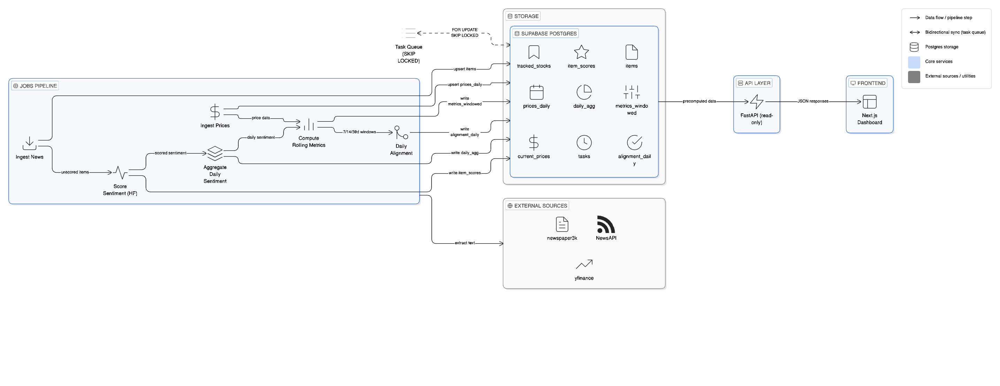

# Market Atlas (Sentiment Reality)

**Find false conviction in financial headlines.**  
Market Atlas measures when financial news sentiment *diverges* from actual stock price movement — and surfaces the exact days + headlines where the narrative failed.

> **YouTube Demo:** [Watch here](https://www.youtube.com/watch?v=ycN8J-_9bts)

---

## Why this is different

Most "stock sentiment" tools stop at *what the news feels like*.

Market Atlas asks a more practical question:

> **Can you trust the story right now?**

It computes a **Narrative Reliability Score** over rolling windows (7/14/30 days), then shows:
- **Where the narrative failed** (specific dates where sentiment disagreed with price returns)
- **Evidence** (the actual headlines that drove the sentiment signal)

This makes the signal **auditable**, not just a black-box score.

---

## What it does

For each tracked stock, Market Atlas:
1. Ingests relevant news articles (NewsAPI)
2. Extracts full text from each URL (newspaper3k)
3. Scores sentiment using a finance-tuned HuggingFace model
4. Fetches historical prices (yfinance)
5. Computes daily aggregates and rolling alignment metrics
6. Displays a single-page dashboard:
   - Reliability score (Aligned / Noisy / Misleading)
   - Misalignment days list (click to inspect)
   - Recent headlines with sentiment labels
   - Basic stock info + returns

---

## Architecture (high-level)



**Strict separation of responsibilities:**
- `jobs/` — all external API calls, all ML inference, all DB writes
- `api/` — read-only queries against Supabase Postgres, returns JSON
- `web/` — dashboard UI, fetches from API only (no external data)

---

## Tech stack

**Backend**
- Python + **FastAPI**
- **Supabase Postgres**
- Raw psycopg2 (no ORM)

**ML / NLP**
- Hugging Face Transformers  
  `mrm8488/distilroberta-finetuned-financial-news-sentiment-analysis`

**Data sources**
- NewsAPI (article metadata)
- newspaper3k (full text extraction)
- yfinance (historical prices)

**Frontend**
- Next.js App Router (single-page dashboard)
- TypeScript + React
- Material UI (MUI) dark theme

---

## Core metric: Narrative Reliability

We compute narrative alignment over a rolling window using:
- **Pearson correlation** between daily sentiment and daily returns
- **Directional match** = fraction of days where sentiment sign matches return sign

Alignment score:

$$
A = 0.5 \times \rho(s, r) + 0.5 \times (2D - 1)
$$

Where *A* = alignment, *ρ(s, r)* = Pearson correlation between sentiment and returns, *D* = directional match rate.

Interpretation:
- $\geq 0.3$ → **Aligned**
- $\leq -0.3$ → **Misleading**
- otherwise → **Noisy**

We also surface **misalignment days** where:
- |sentiment_avg| ≥ 0.05 and |return_1d| ≥ 0.5%
- sentiment sign disagrees with return sign

Sorted by strength: |sentiment| · |return|

---

## Database schema (overview)

| Table | Purpose |
|------|---------|
| `tracked_stocks` | Watchlist tickers |
| `tasks` | Postgres-backed job queue |
| `items` | Raw news article metadata |
| `item_scores` | Per-article ML outputs |
| `prices_daily` | OHLCV + `return_1d` |
| `daily_agg` | Daily sentiment rollups |
| `metrics_windowed` | Rolling alignment metrics |
| `alignment_daily` | Optional daily alignment system |
| `current_prices` | Snapshot cache for latest price |

---

## API surface (internal)

| Route | Method | Description |
|------|--------|-------------|
| `/health` | GET | Health check |
| `/api/stocks` | GET | List tracked stocks |
| `/api/stocks` | POST | Add ticker → enqueue BACKFILL task |
| `/api/stocks/refresh` | POST | Enqueue REFRESH task |
| `/api/dashboard?ticker=X&period=N` | GET | Main dashboard payload |
| `/api/headlines/by-date?ticker=X&date=YYYY-MM-DD` | GET | Drilldown headlines for a day |

---

## How "Refresh" works (end-to-end)

1) User clicks **Refresh** in the dashboard  
2) Frontend calls:

```http
POST /api/stocks/refresh {"ticker":"TSLA"}
```

3) API enqueues a task in `tasks`  
4) Worker claims tasks with `FOR UPDATE SKIP LOCKED`  
5) Pipeline runs per ticker:
   - ingest news → score new items → fetch prices → aggregate → compute metrics  
6) Frontend re-fetches dashboard and renders updated results

> Note: the UI currently uses a fixed delay and re-fetches once. If the pipeline takes longer (e.g., heavy article extraction), the next refresh will reflect the newest state.

---

## Notable design decisions

- **No ML in the request path:** the API never performs inference or external calls; heavy work runs in `jobs/`.
- **Token limits handled properly:** long articles are chunked with overlap; chunk results are aggregated into a single signed score.
- **Idempotent ingestion:** unique constraints + `ON CONFLICT` prevent duplicates and make re-runs safe.
- **Auditable "signal":** misalignment is tied to specific dates + headlines (not just an abstract number).

---

## Known limitations

- Article extraction via newspaper3k can fail on paywalls or unusual markup
- NewsAPI free-tier limits historical backfill depth
- No websocket/streaming updates yet (refresh is queued + later re-fetched)

---

## What's next

- Wire `DAILY_UPDATE_ALL` to GitHub Actions cron for automatic freshness
- Add a cross-ticker "misalignment map" view + filters
- Expand narrative sources (earnings calls, social, analyst notes)
- Improve alignment reliability with volume/confidence weighting and calibration

---

## About this repo

This repository includes:
- `jobs/` — ingestion + ML scoring + aggregation pipeline (writes to DB)
- `api/` — FastAPI read-only API
- `web/` — Next.js dashboard UI
